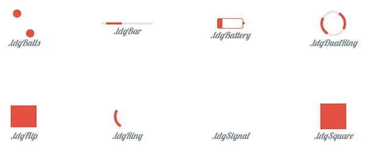

# loading.css
[](https://www.npmjs.com/package/loading-css) [](https://travis-ci.org/welksonramos/loading.css) [](https://packagephobia.now.sh/result?p=loading-css@0.2.0) 
[(https://github.com/welksonramos/loading.css/blob/master/LICENSE)

>  ⌛️ Tiny loaders and spinners made with only css and one div 
[See demo](https://welksonramos.github.io/loading.css/)



## Install
### Fork this repo

```
$ git clone https://github.com/welksonramos/loading.css.git
```
### NPM

```
$ npm install loading-css --save
```
### Manually
Download `loading.css` or `loading.min.css` from this repo and add it to your HTML.


## Usage

1. Include the stylesheet on your document's `<head>`

```html
<link rel="stylesheet"  href="/path/to/loading.css">
```
or

```html
<link rel="stylesheet"  href="/path/to/loading.min.css">
```

2. Add the `loading` class followed by the appropriate [class name](#loading-style-classes) of  for the spinner.

Example:
```html
<div class="loading ldgRing"></div>
````
## Loading style classes

- `ldgBalls`
- `ldgBar`
- `ldgBattery`
- `ldgDualRing`
- `ldgFlip`
 - `ldgHourglass`
- `ldgRing`
- `ldgSignal`
- `ldgSquare`


## File Structure

```
loading.css/
|-- docs                            // Examples
|   |-- index.html
|   |-- loading.css
|   |-- loading.min.css
|
|-- src/                            // Source Stylus files
|   |-- _efects/
|   |    |-- _balls.styl
|   |    |-- _bar.styl
|   |    |-- ...
|   |-- base.styl
|   |-- loading.styl
|
|-- loading.css
|-- loading.min.css
|-- package.json
|-- ...
````
## Tasks

```
$ npm run build
$ npm run minify
$ npm run dev

```

# License

Licensed under the [MIT License](LICENSE)
